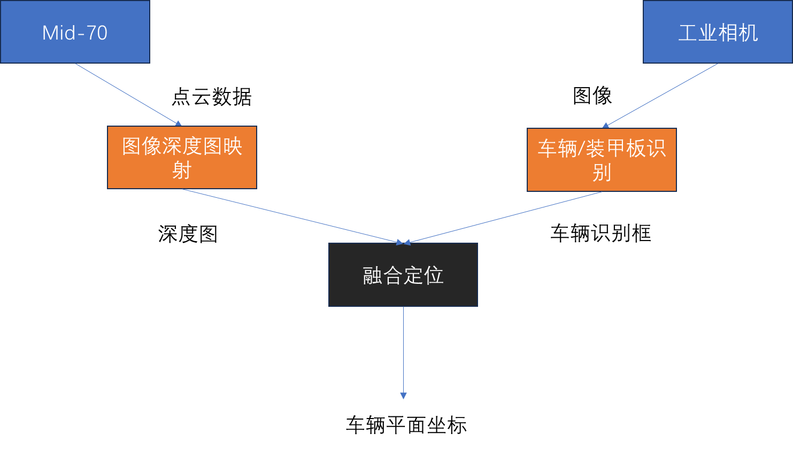
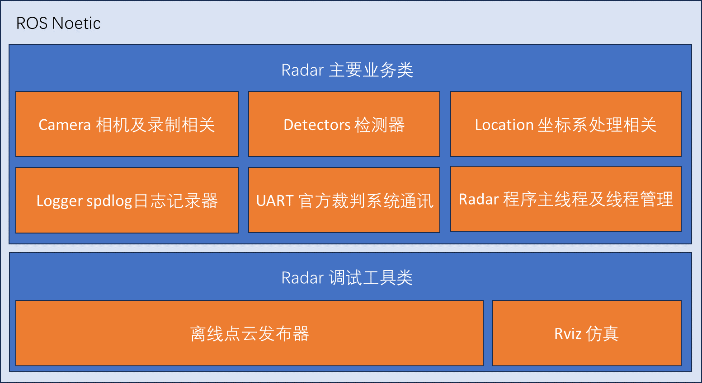

# RM_Radar2023

沈阳航空航天大学T-UP战队2023赛季雷达程序

## Version: V1.4 Experimental

程序点云接收基于ros-noetic框架，使用ROS版Livox雷达驱动

## 0.前言

本赛季出于对后续扩展性考虑，原有雷达程序性能已无法满足继续开发的需求，故进行重构。程序整体的设计目的在于尽可能的压榨算力的条件下保留充足的可扩展性，各模块充分解耦、即插即用，做到程序二次开发简便、扩展性高。

特别感谢上海交通大学[SJTU]提供的开源程序及测试资源对本项目的帮助。

## 1.简介

本程序适用采用激光雷达+单工业相机方案的雷达岗。硬件上我们采用Livox 觅道Mid-70激光雷达和迈德威视MV-SUA630C-T工业相机，串口通讯采用了USB转TTL的方式。根据实际场景，可以选择快速但低精度的简易点云背景分割+单层神经网络方案（CPU+GPU均衡负载）[已废弃]或速度略低但精度较高的双层神经网络方案（GPU重负载CPU轻负载）。

功能：提供场上车辆的高精度坐标

部署前需要自行准备的并更改的有：

* 相机内参与畸变参数
* 相机到激光雷达的外参 推荐使用 [Livox相机-激光雷达 联合标定](https://github.com/Livox-SDK/livox_camera_lidar_calibration "Github链接")
* 网络对应的TensorRT相关参数[废弃]
* 车辆及装甲板识别模型
* 测试视频[可选]

对每个模块更加具体的说明可以参考文件夹下的README.md文件:

> [Camera](src/radar2023/RadarClass/Camera/README.md)
> [Detectors](src/radar2023/RadarClass/Detectors/README.md)
> [Location](src/radar2023/RadarClass/Location/README.md)
> [Radar](src/radar2023/RadarClass/Radar/README.md)

## 2.环境配置

在使用minimum配置或显存为6G时，应注意程序占用，雷达程序显存占用约为5G，显存吃紧时不应运行其他程序。

1[minimum]

* Ubuntu 20.04 LTS
* GCC 9.3.0
* CUDA 11.6
* cudnn 8.6.0
* Tensorrt 8.5.1.7
* ros-noetic
* OpenCV4.6.0
* PCL 1.10.0(ROS安装附带)
* spdlog
* fmt[选择性安装]
* Eigen3
* MKL[可选]
* Livox雷达驱动
* 迈德威视相机驱动

运算平台 (tested && minimum)：

[tested]

* AMD R7 5800H CPU
* DDR4 32G 3200 RAM
* GeForce RTX 3070 Laptop GPU
  
[minimum]

* Intel Core i5-1250P CPU
* DDR4 16G 3200 RAM
* GeForce RTX 3060 Laptop GPU [6GB]

2[best]

* Ubuntu 20.04 LTS
* GCC 9.4.0
* CUDA 11.8
* cudnn 8.9.0
* Tensorrt 8.5.2.2
* ros-noetic
* OpenCV4.6.0
* PCL 1.10.0(ROS安装附带)
* spdlog
* fmt[选择性安装]
* Eigen3
* MKL[可选]
* Livox雷达驱动
* 迈德威视相机驱动

运算平台 (best)：

* Intel Core i9 13900KF CPU
* DDR5 32G 7400 RAM
* GeForce RTX 4090 GPU

## 3.文件结构-SRC

* radar2023
  * demo_resource 存放常用资源和工具
  * logs 日志存放文件夹
  * RadarClass 雷达模块库
    * Camera 相机及录制相关
    * Common 通用文件
    * Detectors 检测器
    * Location 坐标系处理相关
    * Logger spdlog日志记录器
    * Radar 程序主线程及线程管理
    * UART 官方裁判系统通讯
  * tools 调试工具
  * Recorder 录制文件存放
  * CMakeLists.txt CMake文件
  * config.h 程序参数配置文件
  * main.cpp 程序主文件
  * package.xml ROS

## 4.其他

### 相关图示




### 使用前准备

* 环境配置完成后，需根据运算平台及环境修改src下CMakeLists.txt

  * 特别注意事项：
  * 应根据设备显卡型号及其算力修改第20行 CUDA_GEN_CODE 例：RTX 3060 ： -gencode=arch=compute_86, code=sm_86 ; RTX 3070 : -gencode=arch=compute_86, code=sm_86 ; RTX 2080 -gencode=arch=compute_75, code=sm_75 ;
  * 支持：
  * | **Pascal (CUDA 8 and later)**                                                                                                                                                                                                              |
    | ------------------------------------------------------------------------------------------------------------------------------------------------------------------------------------------------------------------------------------------------ |
    | **SM60 or `SM_60, compute_60`** –                                                                                                                                                                                                       |
    | Quadro GP100, Tesla P100, DGX-1 (Generic Pascal)                                                                                                                                                                                                 |
    | **SM61 or `SM_61, compute_61`** –                                                                                                                                                                                                       |
    | GTX 1080, GTX 1070, GTX 1060, GTX 1050, GTX 1030 (GP108), GT 1010,<br />(GP108) Titan Xp, Tesla P40, Tesla P4, Discrete GPU on the NVIDIA Drive,<br />PX2                                                                                        |
    | **SM62 or `SM_62, compute_62`** –                                                                                                                                                                                                       |
    | Integrated GPU on the NVIDIA Drive PX2, Tegra (Jetson) TX2                                                                                                                                                                                       |
    | **Volta (CUDA 9 and later)**                                                                                                                                                                                                               |
    | **SM70 or `SM_70, compute_70`** –                                                                                                                                                                                                       |
    | DGX-1 with Volta, Tesla V100, GTX 1180 (GV104), Titan V, Quadro GV100                                                                                                                                                                            |
    | **SM72 or `SM_72, compute_72`** –                                                                                                                                                                                                       |
    | Jetson AGX Xavier, Drive AGX Pegasus, Xavier NX                                                                                                                                                                                                  |
    | **Turing (CUDA 10 and later)**                                                                                                                                                                                                             |
    | **SM75 or `SM_75, compute_75`** –                                                                                                                                                                                                       |
    | GTX/RTX Turing – GTX 1660 Ti, RTX 2060,RTX 2070, RTX 2080, Titan RTX,<br /> Quadro RTX 4000, Quadro RTX 5000, Quadro RTX 6000, Quadro RTX 8000, <br />Quadro T1000/T2000, Tesla T4                                                              |
    | **Ampere (CUDA 11.1 and later)**                                                                                                                                                                                                           |
    | **SM80 or `SM_80, compute_80`** –                                                                                                                                                                                                       |
    | NVIDIA[A100] (the name “Tesla” has been dropped – GA100), NVIDIA DGX-A100                                                                                                                                                                     |
    | ****SM86 or `SM_86, compute_86`** –** <br />(from [CUDA 11.1 onwards](https://docs.nvidia.com/cuda/ptx-compiler-api/index.html))                                                                                                     |
    | Tesla GA10x cards, RTX Ampere – RTX 3080, GA102 – RTX 3090, RTX<br />A2000, A3000, RTX A4000, A5000, A6000, NVIDIA A40, GA106 – RTX 3060,<br />GA104 – RTX 3070, GA107 – RTX 3050, RTX A10, RTX A16, RTX A40, A2 <br />Tensor Core GPU     |
    | ****SM87 or `SM_87, compute_87`** –** <br />(from [CUDA 11.4 onwards](https://docs.nvidia.com/cuda/ptx-compiler-api/index.html), introduced with PTX ISA 7.4 / Driver r470 and newer) – for Jetson AGX Orin and Drive AGX Orin only |
    | **Lovelace (CUDA 11.8 and later)**                                                                                                                                                                                                         |
    | **SM89 or `SM_89, compute_89`** –                                                                                                                                                                                                       |
    | NVIDIA GeForce RTX 4090, RTX 4080,RTX 6000, Tesla L40                                                                                                                                                                                            |
    | **Hopper (CUDA 12 and later)**                                                                                                                                                                                                             |
    | **SM90 or `SM_90, compute_90`** –                                                                                                                                                                                                       |
    | NVIDIA H100 (GH100)                                                                                                                                                                                                                              |
    | **SM90a or `SM_90a, compute_90a`** – (for PTX ISA version 8.0) – adds                                                                                                                                                                  |
* 若不使用MKL，注释掉src/radar2023/CMakeLists.txt ->34 include_directories(/opt/intel/oneapi/mkl/latest/include)、35 link_directories(/opt/intel/oneapi/mkl/latest/lib/intel64) 、108 libmkl_rt.so 和 src/radar2023/RadarClass/Common/include/public.h
  -> 3 #define EIGEN_USE_MKL_ALL、4 #define EIGEN_VECTORIZE_SSE4_2 [可选]
* 创建以下文件夹：src/radar2023/logs 、src/radar2023/Recorder 、  src/radar2023/RadarClass/Detectors/models  、 src/radar2023/RadarClass/Camera/params
* 修改config.h中的路径及相关配置

  * 特别注意事项：
  * 本项目不存在测试用视频，需自行准备并放置于TestVideoPath对应路径
* 准备装甲板识别及车辆识别模型，现版本可用模型为yolov5 v6.0，注意导出动态Onnx
* 车辆分类[CAR]
* 装甲板分类[B1 B2 B3 B4 B5 B7 R1 R2 R3 R4 R5 R7 N1 N2 N3 N4 N5 N7 P1 P2 P3 P4 P5 P7]

  * 程序中仅使用[B1 B2 B3 B4 B5 B7 R1 R2 R3 R4 R5 R7]
* 将yolov5导出的动态尺寸onnx放置于config.h定义位置
* 将标定所得参数放置在src/radar2023/RadarClass/Camera/params文件夹中，格式如camera0.yaml所示
* 确保ROS环境激活后在RM_RADAR2023文件夹下使用：

  ```
  catkin_make
  ```
* 为串口及雷达驱动添加权限[在串口权限自动设置失败时使用]

### 启动

```
source devel/setup.bash
roslaunch radar2023 radar2023.launch
```

### 使用

1.若第一次运行，程序会针对运行设备进行Onnx生成Engine的过程，根据设备算力，时间在1～10分钟不等，此操作会一共进行两次（车辆模型和装甲板模型）。

2.初始化完成后，程序会尝试启动相机并展示一张预览图，若对相机曝光、增益不满意，在预览图上按“t”进入调节界面，在调节界面中有相应的退出滑条。

3.相机预览结束后，进入四点标注界面，根据提示完成标注点选取，每确定一点，在标定窗口按“z”撤回，按其他任意键确定。Tips: 在src/RadarClass/Location/src/location.cpp -> locate_pick函数中更改使用的3D点；在src/radar2023/RadarClass/Common/include/public.h -> location_targets中更改3D点坐标。

4.标定结束后，进入控制窗口，可控制程序退出和视频录制，在图像中显示空间点反投影效果和识别车辆，对标定结果不满意可退出程序重新标定。

5.【不稳定功能未在此列出】

### 其他Launch文件说明-使用离线点云

使用下列launch前需修改其中pcd_path参数

预置pcds.txt由上交开源程序提供，需搭配上交开源视频[非上交视频仅用于正常运行]

* OfflinePointCloudPub_and_Rviz.launch //启动离线点云发布及Rviz
  ```
  roslaunch radar2023 OfflinePointCloudPub_and_Rviz.launch
  ```
* OfflinePointCloudPub.launch //启动离线点云发布
  ```
  roslaunch radar2023 OfflinePointCloudPub.launch
  ```
* radar2023_with_OfflinePointCloudPub_and_Rviz.launch //启动离线点云发布、Rviz及雷达主程序
  ```
  roslaunch radar2023 radar2023_with_OfflinePointCloudPub_and_Rviz.launch
  ```
* radar2023_with_OfflinePointCloudPub.launch //启动离线点云发布及雷达主程序
  ```
  roslaunch radar2023 radar2023_with_OfflinePointCloudPub.launch
  ```

### 实验性功能-深度图背景分割

#### 简介

本程序提供实验性的基于点云深度图的目标分割算法

点云深度图背景分割算法为纯CPU负载算法，开启后可极大减轻GPU运算压力和显存占用，但相较于双层神经网络方案存在精度较差的问题

#### 使用

修改Config.h中注释掉的UsePointCloudSepTarget项目及配套配置

重新编译即可使用

#### 注意

此为实验性功能，不保证有效效果

### 实验性功能-深度图背景分割

#### 简介

本程序提供实验性的DeepSort目标跟踪

利用DeepSort稳定目标类别跟踪，可有效应对装甲板长时间丢失的情况

#### 使用

修改Config.h中注释掉的UseDeepSort项目及配套配置

重新编译即可使用

#### 注意

此为实验性功能且性能消耗极大，不保证有效效果

### 开发日志

Date:2023.9.30 V1.4:更新实验性DeepSort

Date:2023.9.24 V1.3:上传实验性点云背景分割

Date:2023.6.8 V1.2:修复UART错误，切换spdlog至head-only,更新v1.2 GameReady版本

Date:2023.5.30 V1.1:添加离线点云调试工具

Date:2023.5.29 雷达已完善，发布V1.0g测试版本

Date:2023.5.27 主要功能测试通过，发布V0.9b测试版本

Date:2023.5.13 更换推理模块，删除废弃功能，发布V0.3a内部测试版本

Date:2022-12-31 经过一轮调试Debug与更新，发布V0.2a内部测试版本

Date:2022-12-04 完成所有基本功能构建，发布V0.1a内部测试版本

### Q&A

1. Q: 程序内存占用持续升高，过不了多久就会OOM怎么办？
   * A: 使用视频或高帧率相机时，图像队列可能会因为主线程无法及时将图像pop出而持续累积，应适当减少config.h中 FRAME_DEPTH 的值。
2. Q: 程序可否运行在6GB显存的显卡上？
   * A: 可以，正常运行时，程序的显存占用为5GB左右。
3. Q: 在程序初次运行时，会长时间没有输出，并抛出TRT警告。
   * A: 此为正常现象，初次运行时程序会根据设备进行onnx到engine的转化，因设备性能差异持续1～10分钟不等。
4. Q: 我是3060显卡，运行时抛出cuda failure: 2怎么办？
   * A: 检查config.h中TensorRTEnginePath、TensorRTEnginePath_c路径是否合法，报错中应当存在"Engine bad file"。
   * A: 运行雷达程序时，尽可能减少其他程序对显存的占用。
5. Q: engine生成了，但是运行程序时没有检出怎么办？
   * A: 程序中所提供的onnx模型已在多台设备上通过测试，请确认CMakeLists.txt中CUDA_GEN_CODE项设置正确。
6. Q: 可否更换到自用Yolov5模型？
   * A: 可以，但需要导出动态onnx并确认单输入单输出，程序中相应修改：MapMapping.h -> _ids的映射值、Radar.h -> ids过滤id。

### Issues

1. 在控制窗口再次进入四点标定模式时会抛出窗口丢失的错误，导致窗口缩放异常无法完成标定
   1. 暂时通过重启程序来避开此问题
   2. 进入标定的控制滑条已移除
2. 在使用相机时绘制结果会发生闪烁
   1. 暂时不影响程序运行
   2. 疑似相机驱动类存在逻辑BUG
3. 异常退出的程序并不会释放显存
   1. 通过关闭终端来释放显存
